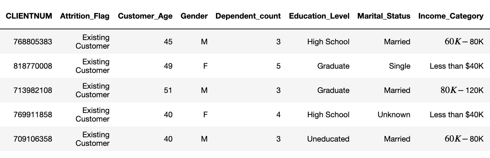

# Predict Customer Churn

- Project **Predict Customer Churn** of ML DevOps Engineer Nanodegree Udacity

# Introduction

This project will identify credit card customers that are most likely to churn. 

# How to Run

- Enter the following command in the terminal：
1. 'python churn_library.py'

    It will generates some EDA plots in the folder *./images/eda/*, some feature plots in the folder *./images/results/*, and save models in the folder *./models/*.

2. 'python churn_script_logging_and_tests.py'

    It will test and log the functions in *churn_library.py*, you will see all test and log information be stored in *./logs/churn_library.log*.

# Files and data description

## Bank Data
This dataset came from Kaggle. You can read more about it from [here](https://www.kaggle.com/datasets/sakshigoyal7/credit-card-customers/code).

File : *./data/bank_data.csv*

Below are the first few rows associated with the dataset for this project.

## Project Files
1. **churn_library.py** is a library of functions to find customers who are likely to churn.

2. **churn_script_logging_and_tests.py** contains unit tests for the churn_library.py functions. It will log any errors and INFO messages. 

3. **./libs/plots.py** contains all eda plot functions.

4. **README.md** provides description of this project.

